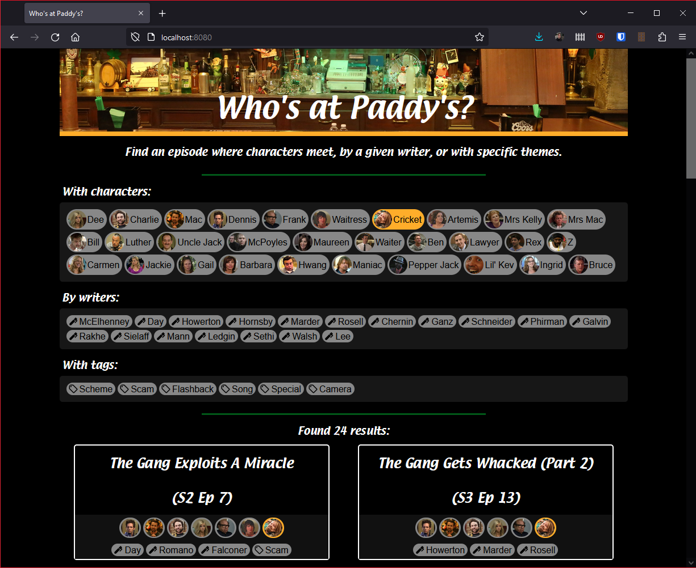

# whosatpaddys.pub



Website built with [fabricate.js]() and TypeScript to allow filtering of
episodes of It's Always Sunny in Philadelphia based on featured characters,
writers, and tags.

Deploys automatically with GitHub Actions on commit to `master`.

## Setup

```
npm ci
```

## Build

```
npm run build
```

## Run locally

```
npm start
```
